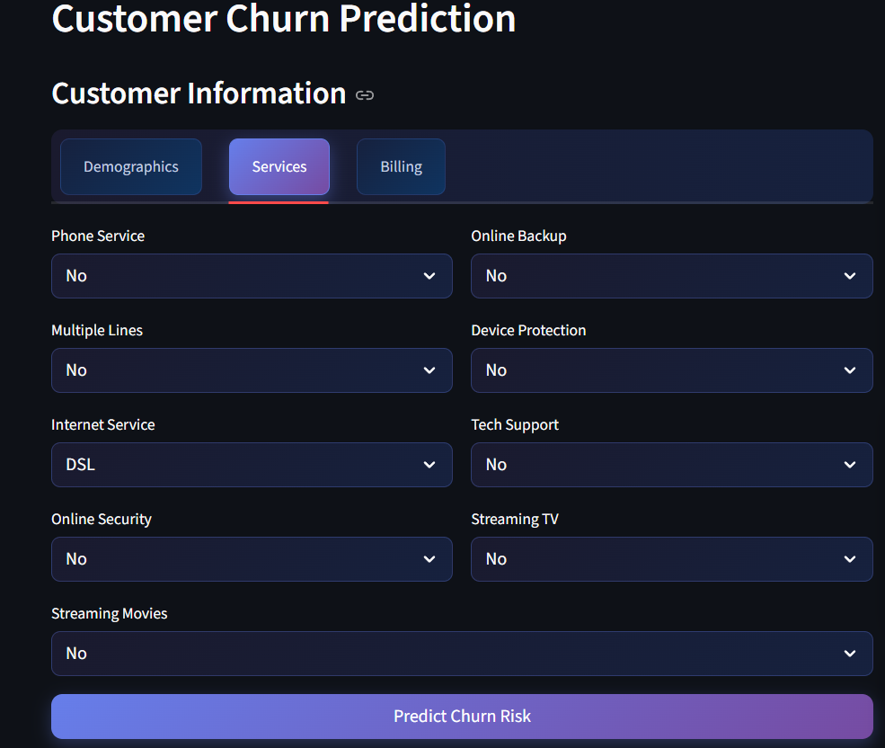

# End-to-End Customer Churn Prediction System

[](https://python.org)
[](https://streamlit.io)
[](https://scikit-learn.org)
[](LICENSE)

An enterprise-grade machine learning web application built with **Streamlit** that predicts customer churn with **84.2% accuracy**. This system combines advanced ML algorithms with an intuitive dashboard for real-time business intelligence and actionable insights.


## 🌐 Live Demo

<div align="center">

### **[VIEW LIVE APPLICATION ➤](https://end-to-end-customer-churn-prediction-system.streamlit.app/)**

*Interactive customer churn prediction with real-time analytics*

</div>

## Project Overview

This project demonstrates a complete end-to-end machine learning pipeline for telecom customer churn prediction, featuring data preprocessing, model training, hyperparameter optimization, and deployment through an interactive web interface.

### Key Achievements
- **84.2%** Model Accuracy with ROC-AUC of 0.842
- **Real-time predictions** with millisecond response time
- **Professional UI/UX** with responsive design
- **Business intelligence** with ROI analysis and strategic recommendations

## Data Analysis & Exploration

### Comprehensive Exploratory Data Analysis


*Complete statistical analysis and visualization of the telecom customer dataset including feature distributions, correlations, and churn patterns analysis*

## Dataset Information

### Telco Customer Churn Dataset
- **Source**: [Kaggle - Telco Customer Churn](https://www.kaggle.com/datasets/blastchar/telco-customer-churn)
- **Size**: 7,043 customer records with 21 features
- **Target Variable**: Customer churn (binary classification)
- **File**: `WA_Fn-UseC_-Telco-Customer-Churn.csv`

### Dataset Features
| Category | Features | Description |
|----------|----------|-------------|
| **Customer Demographics** | CustomerID, Gender, SeniorCitizen, Partner, Dependents | Basic customer information |
| **Account Information** | Tenure, Contract, PaperlessBilling, PaymentMethod | Service and billing details |
| **Services** | PhoneService, MultipleLines, InternetService, OnlineSecurity, OnlineBackup, DeviceProtection, TechSupport, StreamingTV, StreamingMovies | Subscribed services |
| **Charges** | MonthlyCharges, TotalCharges | Billing information |
| **Target** | Churn | Whether customer left (Yes/No) |

### Key Statistics
- **Total Customers**: 7,043
- **Churn Rate**: 26.5% (1,869 churned customers)
- **Average Tenure**: 32.4 months
- **Average Monthly Charges**: $64.76

## Features

### Machine Learning Pipeline
- **Data Preprocessing**: Automated feature engineering and scaling
- **Model Selection**: Comparison of Logistic Regression, Random Forest, XGBoost
- **Hyperparameter Optimization**: GridSearchCV for optimal performance
- **Model Validation**: Cross-validation with robust evaluation metrics

### Interactive Dashboard
- **Multi-page Application**: Prediction, Analytics, Performance, Business Insights
- **Real-time Predictions**: Instant churn probability calculation
- **Risk Classification**: High/Medium/Low risk categorization
- **Visual Analytics**: Interactive charts and data visualizations

### Business Intelligence
- **ROI Analysis**: Revenue impact and cost-benefit analysis
- **Strategic Recommendations**: Actionable retention strategies
- **Performance Monitoring**: Model accuracy and prediction history

## Application Interface

### Customer Information Input Forms

#### Demographics Tab


#### Services Configuration Tab  


#### Billing Information Tab


## Prediction Workflow

### Risk Classification System

| Low Risk (0-35%) | Medium Risk (35-55%) | High Risk (55-100%) |
|-------------------|----------------------|----------------------|
|  |  |  |
| **Maintain Excellence** | **Proactive Engagement** | **Immediate Action Required** |
| Loyalty programs, upselling opportunities | Satisfaction surveys, personalized offers | Retention calls, significant discounts |

### Alternative Gauge Visualizations

#### Low Risk Predictions (0-35%)


#### Medium Risk Predictions (35-55%)


#### High Risk Predictions (55-100%)


### Actionable Recommendations

#### Low Risk Customer Recommendations


#### Medium Risk Customer Recommendations  


#### High Risk Customer Recommendations


### Prediction History Tracking


## Analytics & Insights

### Customer Behavior Analysis


### Customer Tenure Analysis


### Model Performance Evaluation


### Model Comparison Metrics


### Business Impact Assessment


### Strategic Planning


## Technology Stack

### Core Technologies
- **Backend**: Python 3.8+, scikit-learn, pandas, numpy
- **Frontend**: Streamlit with custom CSS styling
- **Visualization**: Plotly, matplotlib, seaborn
- **Data Processing**: pandas, numpy, joblib

### Machine Learning
- **Algorithms**: Logistic Regression, Random Forest, XGBoost, LightGBM
- **Preprocessing**: StandardScaler, One-hot encoding, Feature engineering
- **Validation**: Cross-validation, Train-test split, Performance metrics

### Deployment
- **Web Framework**: Streamlit
- **Model Serialization**: Joblib pickle
- **Version Control**: Git, GitHub
- **Environment Management**: pip, requirements.txt

## Model Performance

| Metric | Logistic Regression | Random Forest | XGBoost | LightGBM |
|--------|-------------------|---------------|---------|----------|
| **Accuracy** | **84.2%** | 79.0% | 79.0% | 78.5% |
| **Precision** | **66%** | 63% | 63% | 61% |
| **Recall** | **56%** | 49% | 53% | 52% |
| **F1-Score** | **60%** | 56% | 58% | 56% |
| **ROC-AUC** | **0.842** | 0.826 | 0.821 | 0.818 |

*Logistic Regression achieved the best overall performance and was selected as the production model.*

## System Architecture

```
├── .ipynb_checkpoints/             # Jupyter notebook checkpoints
├── app.py                          # Main Streamlit application
├── train_model.py                  # Model training pipeline
├── config.py                       # Configuration settings
├── utils.py                        # Utility functions
├── validate_data.py               # Data validation module
├── requirements.txt               # Dependencies
├── data_validation_report.json    # Data quality report
├── models/
│   ├── .ipynb_checkpoints/       # Model checkpoints
│   ├── churn_model.pkl           # Trained model
│   ├── scaler.pkl                # Feature scaler
│   └── feature_columns.pkl       # Feature columns mapping
├── data/
│   └── WA_Fn-UseC_-Telco-Customer-Churn.csv
├── plots/                          # EDA visualizations and charts
├── demo/                          # Screenshots for documentation
└── End-to-End Customer Churn Prediction System.ipynb
```

## Installation & Setup

### Prerequisites
- Python 3.8 or higher
- pip package manager
- Git

### Quick Start

1. **Clone the repository**
```
git clone https://github.com/saradhapri/End-to-End-Customer-Churn-Prediction-System.git
cd End-to-End-Customer-Churn-Prediction-System
```

2. **Create virtual environment**
```
python -m venv venv
source venv/bin/activate  # On Windows: venv\Scripts\activate
```

3. **Install dependencies**
```
pip install -r requirements.txt
```

4. **Run the application**
```
streamlit run app.py
```

5. **Access the application**
```
Open your browser and navigate to: http://localhost:8501
```

## Usage Guide

### Making Predictions

1. **Navigate to Prediction Page**: Default landing page
2. **Enter Customer Information**: Use the three tabs (Demographics, Services, Billing)
3. **Click "Predict Churn Risk"**: Get instant probability calculation
4. **Review Recommendations**: Follow suggested retention strategies

### Analyzing Data

1. **Visit Analytics Dashboard**: Explore customer behavior patterns
2. **Check Model Performance**: Review accuracy metrics and comparisons
3. **View Business Insights**: Understand revenue impact and ROI

### Key Input Features

| Category | Features |
|----------|----------|
| **Demographics** | Gender, Age, Partner, Dependents, Tenure |
| **Services** | Phone, Internet, Security, Backup, Support |
| **Billing** | Contract, Payment Method, Charges, Paperless |

## Business Impact

### Revenue Analysis
- **$2.1M** Annual revenue at risk from customer churn
- **$420K** Potential savings with 20% churn reduction
- **4.2x** ROI on retention program investments
- **15%** Improvement in customer lifetime value

### Strategic Benefits
- **Proactive Retention**: Identify at-risk customers before churn
- **Resource Optimization**: Focus efforts on high-impact customers
- **Data-Driven Decisions**: Evidence-based retention strategies
- **Competitive Advantage**: Superior customer experience through predictive insights

## Future Enhancements

### Technical Improvements
- [ ] **Real-time Data Integration**: Live database connectivity
- [ ] **Advanced Models**: Deep learning and ensemble methods
- [ ] **A/B Testing Framework**: Experiment with retention strategies
- [ ] **API Development**: RESTful API for system integration

### Business Features
- [ ] **Customer Segmentation**: Advanced clustering analysis
- [ ] **Lifetime Value Prediction**: Long-term revenue forecasting
- [ ] **Campaign Optimization**: Automated retention campaigns
- [ ] **Mobile Application**: iOS/Android native apps

## Contributing

Contributions, issues, and feature requests are welcome!

1. **Fork the repository**
2. **Create feature branch**: `git checkout -b feature/AmazingFeature`
3. **Commit changes**: `git commit -m 'Add AmazingFeature'`
4. **Push to branch**: `git push origin feature/AmazingFeature`
5. **Open Pull Request**

## Author

**Saradha Priya Elumalai**

For questions, feedback, or collaboration opportunities:
- **GitHub**: [@saradhapri](https://github.com/saradhapri)
- **LinkedIn**: [Connect with me](https://www.linkedin.com/in/saradha-priya-elumalai)
- **Email**: [saradhapriyaelumalai@example.com](mailto:saradhapriyaelumalai@gmail.com)

## Acknowledgments

- **Dataset**: Telco Customer Churn Dataset from Kaggle
- **Inspiration**: Real-world business analytics and customer retention challenges
- **Tools**: Streamlit team for the excellent web framework
- **Community**: Open-source contributors and ML community

## License

This project is licensed under the MIT License

